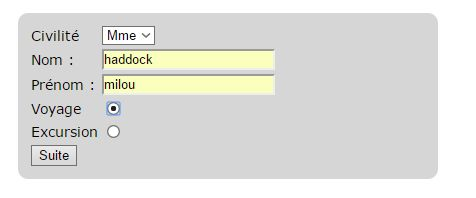
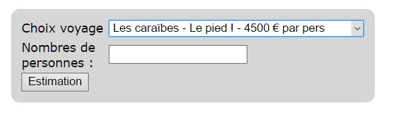
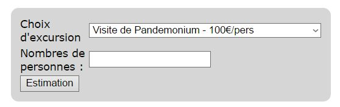

# Agence de voyage

## Objectif

A partir de tout ce que vous avez vu depuis le début de la formation (HTML, CSS, Bootstrap, PHP), créez un mini site d'agence de voyage.

## Consignes :
Créez obligatoirement un formulaire selon le modèle ci-joint (nom de la page : formulaire.php)

Selon le choix (voyage ou excursion), vous êtes dirigés vers une seule page (_agence.php_) qui vous propose 2 voyages possibles (voyages au choix avec un prix) ou deux excursions (au choix avec un prix).

**Voyage**

**Excursion**

Enfin cette page transfère et fait le récapitulatif des choix faits ainsi que le montant total en fonction du nombre de personnes.

## Hosting
Vous pouvez uploadez otre site avec GitHub page, more info here:
https://pages.github.com/
ou encore le tester en local sur votre système ubuntu